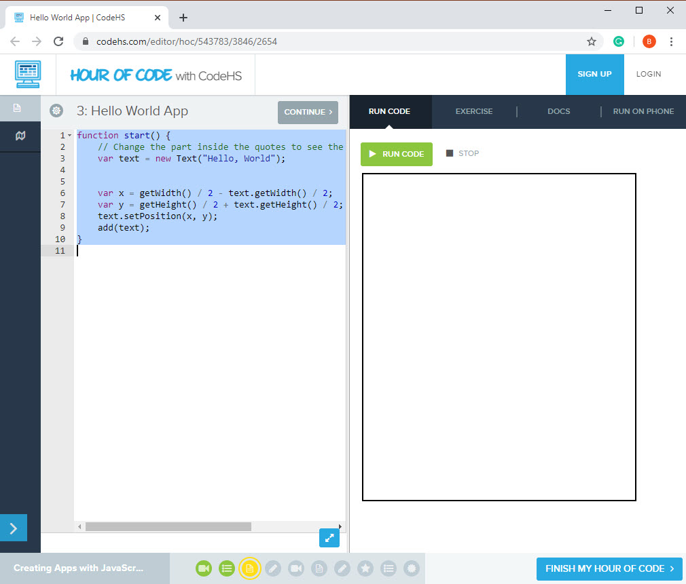
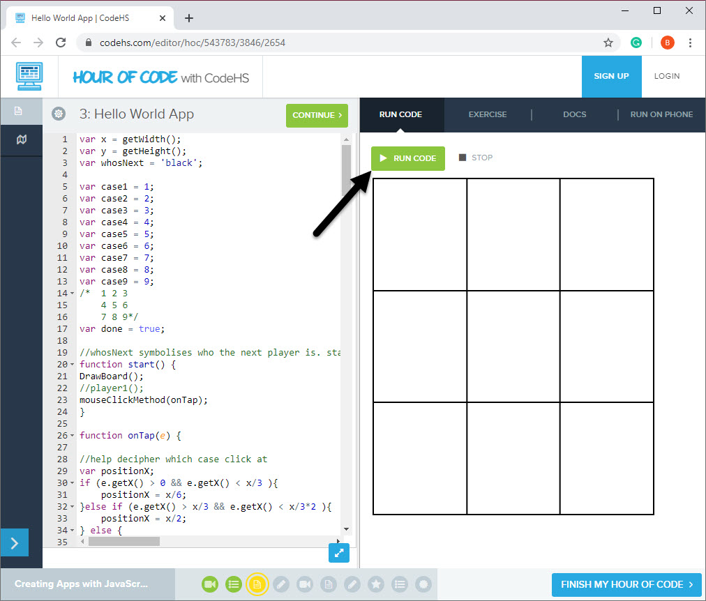

# Tic Tac Toe
## How to play
### firstly when you click on the black screen when you are done it must be able to switch back and take away the black screen. Then, make a separate sheet for AI. If can try to merge the AI with the original. maybe start with a screen that ask wether u want AI or what.
1. Go to [this page](https://codehs.com/editor/hoc/543783/3846/2654) and press explore this example. 
 
1. __Erase the code__.

1. Then __paste the tictactoe code__ from __tictactoe.js__ inside of it 

1. __press run code to begin__.

1. To stop, press stop. 

#### Please feel free to play around with the code and suggest changes. 