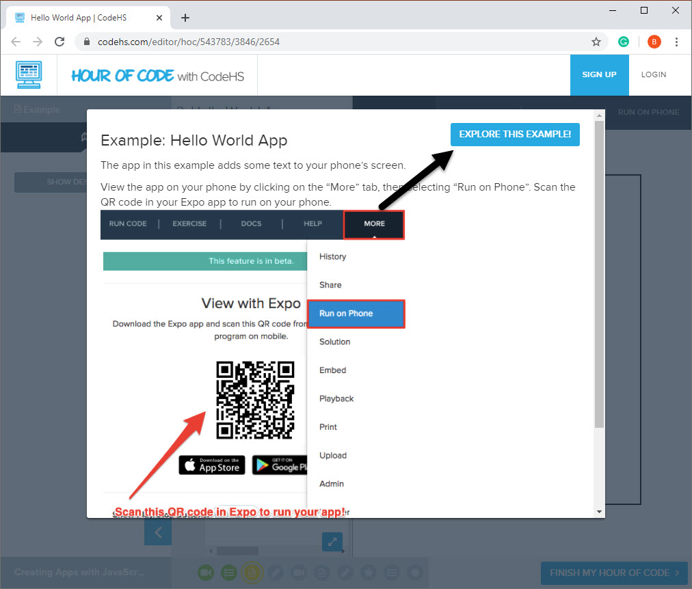

# Tic Tac Toe
## How to play
1. Go to [this page](https://codehs.com/editor/hoc/543783/3846/2654) and press explore example. 
 
1. __Erase the code__.
(erase.jpg)
1. Then __paste the tictactoe code__ from __tictactoe.js__ inside of it 
1. __press run code to begin__.
1. To stop, press stop. 
### Please feel free to play around with the code 
  

 
